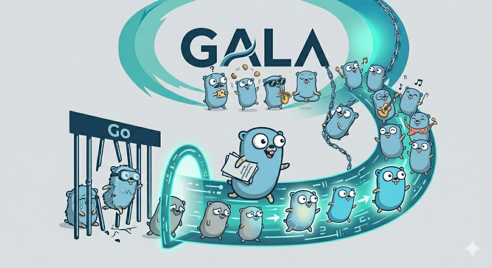

# GALA

**Sum types, exhaustive pattern matching, and `Option`/`Try` — the type system Go is missing, as a language, not a library.**

**Scala on Go.**

[](https://github.com/martianoff/gala/actions/workflows/test.yml)
[](https://github.com/martianoff/gala/releases)
[](https://github.com/martianoff/gala/releases/latest)
[](LICENSE)
[](https://go.dev)
[](https://bazel.build)
[](CONTRIBUTING.MD)



```gala
sealed type Shape {
    case Circle(Radius float64)
    case Rectangle(Width float64, Height float64)
}

func area(s Shape) string = s match {
    case Circle(r)       => f"circle area: ${3.14159 * r * r}%.2f"
    case Rectangle(w, h) => f"rect area: ${w * h}%.2f"
}
```

**[Try it in your browser](https://gala-playground.fly.dev)** — no install.

---

## What is GALA?

GALA is a statically typed, functional-first language that transpiles to Go. You get sealed types, exhaustive pattern matching, immutable collections, and a real monad stack (`Option`, `Either`, `Try`, `Future`, `IO`) — and you keep the entire Go ecosystem, including third-party modules, working out of the box.

It's aimed at Go developers who have used Scala, Kotlin, F#, or OCaml and miss the type system.

*(GALA stands for Go Alternative LAnguage.)*

---

## Why GALA? — Safe, Ergonomic, Compatible

**Safe — Go's runtime bugs, caught by the compiler.**
- **Sealed types with exhaustive matching.** The compiler rejects incomplete matches at build time — including nested patterns, guards, and generic extractors. An incomplete `match` is a build error, not a production panic.
- **No `nil`.** `Option` / `Either` / `Try` replace nil checks and naked error returns.
- **Immutable by default.** `val` bindings, immutable struct fields, read-only `ConstPtr[T]`; always concrete types, never a silent `any`.
- **Zero-reflection JSON.** `Codec[T]` is backed by a compiler-generated `StructMeta[T]` intrinsic — no `reflect`, no struct tags, and it doubles as a pattern-match extractor.

**Ergonomic — the functional code you want to write, minus the ceremony.**
- **`bind` / `also` do-notation.** Flat monadic binding over any monad — sequential `bind`, plus `also` for independent steps that accumulate errors (`Validated`) or run concurrently (`Future`). No nested `FlatMap` staircases.
- **Functional standard library.** `Option`, `Either`, `Try`, `Future`, `IO` with `Map` / `FlatMap` / `Recover`, plus immutable `List`, `Array`, `HashMap`, `HashSet`, `TreeSet`, `TreeMap`.
- **Less syntax.** String interpolation (`s"…"` / `f"…"`), named arguments and default parameters, type inference everywhere, expression functions, and regex extractors that destructure capture groups directly inside `match`.

**Compatible — every Go library, no bindings, native binaries.**
- **Full Go third-party module interop.** Any Go package works — not just stdlib. Return types are inferred **directly from the Go SDK** (no declaration files), and `(T, error)` returns are wrapped into `Try[T]` automatically.
- **Shipped IDE tooling.** GoLand/IntelliJ plugin and an LSP server (`gala lsp`) for VS Code and Neovim — diagnostics, hover, go-to-definition, inlay hints, completion. Batched transpilation and analysis caching keep multi-file rebuilds fast.

---

## Quick Start

### 1. Install

Download a pre-built binary from [Releases](https://github.com/martianoff/gala/releases), rename it to `gala` (or `gala.exe` on Windows), and put it on your `PATH`.

GALA transpiles to Go, so it needs [Go 1.25+](https://go.dev/dl/) on your `PATH` to compile programs.

Or build from source:

```bash
git clone https://github.com/martianoff/gala.git && cd gala
bazel build //cmd/gala:gala
```

### 2. Write `main.gala`

```gala
package main

struct Person(Name string, Age int)

func greet(p Person) string = p match {
    case Person(name, age) if age < 18 => s"Hey, $name!"
    case Person(name, _)               => s"Hello, $name"
    case _                             => "Unknown"
}

func main() {
    Println(greet(Person("Alice", 25)))
}
```

### 3. Run

```bash
gala mod init example.com/hello
gala run main.gala     # Transpile + compile + run
gala build             # Build project to a binary
gala test              # Run tests
```

**Need help?** Ask in [GitHub Discussions](https://github.com/martianoff/gala/discussions).

---

## GALA vs Go

### Pattern Matching vs Switch

<table>
<tr><th>GALA</th><th>Go</th></tr>
<tr>
<td>

```gala
val msg = shape match {
    case Circle(r)      => f"r=$r%.1f"
    case Rectangle(w,h) => f"$w%.0fx$h%.0f"
    case Point()        => "point"
}
```

</td>
<td>

```go
var msg string
switch shape._variant {
case Shape_Circle:
    msg = fmt.Sprintf("r=%.1f", shape.Radius.Get())
case Shape_Rectangle:
    msg = fmt.Sprintf("%fx%f", shape.Width.Get(), shape.Height.Get())
case Shape_Point:
    msg = "point"
}
```

</td>
</tr>
</table>

### Option Handling vs nil Checks

<table>
<tr><th>GALA</th><th>Go</th></tr>
<tr>
<td>

```gala
val name = user.Name
    .Map((n) => strings.ToUpper(n))
    .GetOrElse("ANONYMOUS")
```

</td>
<td>

```go
name := "ANONYMOUS"
if user.Name != nil {
    name = strings.ToUpper(*user.Name)
}
```

</td>
</tr>
</table>

### Immutable Structs vs Manual Copying

<table>
<tr><th>GALA</th><th>Go</th></tr>
<tr>
<td>

```gala
struct Config(Host string, Port int)
val updated = config.Copy(Port = 8080)
```

</td>
<td>

```go
type Config struct {
    Host string
    Port int
}
updated := Config{Host: config.Host, Port: 8080}
```

</td>
</tr>
</table>

### Default Parameters vs Option Structs

<table>
<tr><th>GALA</th><th>Go</th></tr>
<tr>
<td>

```gala
func connect(
    host string,
    port int = 8080,
    tls bool = true,
) Connection

connect("localhost", tls = false)
```

</td>
<td>

```go
type ConnectOptions struct {
    Host string
    Port int
    TLS  *bool
}

func Connect(opts ConnectOptions) Connection {
    if opts.Port == 0 { opts.Port = 8080 }
    if opts.TLS == nil {
        t := true; opts.TLS = &t
    }
    // ...
}
Connect(ConnectOptions{Host: "localhost", TLS: ptrBool(false)})
```

</td>
</tr>
</table>

### Error Handling: Try vs if-err

<table>
<tr><th>GALA</th><th>Go</th></tr>
<tr>
<td>

```gala
val result = divide(10, 2)
    .Map((x) => x * 2)
    .FlatMap((x) => divide(x, 3))
    .Recover((e) => 0)
```

</td>
<td>

```go
result, err := divide(10, 2)
if err != nil {
    result = 0
} else {
    result = result * 2
    result, err = divide(result, 3)
    if err != nil {
        result = 0
    }
}
```

</td>
</tr>
</table>

---

## Monadic Binding: `bind` / `also`

`Map`/`FlatMap` chains nest badly the moment a later step needs an earlier value. `bind` flattens them — every binding is a normal immutable local that stays in scope, and the block short-circuits on the first failure:

```gala
func processOrder(id int) Try[Receipt] {
    bind o       = fetchOrder(id)
    bind valid   = validateOrder(o)
    bind payment = chargePayment(valid)
    Success(Receipt(o.Id, payment))   // `o` still in scope; no nested FlatMap
}
```

`also` marks a bind as **independent** of its group, and the block's type decides what that unlocks. Over `Validated` it **accumulates every error** instead of stopping at the first:

```gala
import . "martianoff/gala/validation"

func makePerson(name string, email string, age int) Validated[string, Person] {
    bind n = vName(name)
    also e = vEmail(email)
    also a = vAge(age)
    Valid(Person(n, e, a))
}
// makePerson("", "", -1).GetErrors().Size() == 3  — all failures at once
```

Over `Future`, an `also` group runs its clauses **concurrently**. And it's not special-cased to the standard library: any type with a `FlatMap` method is bindable, resolved structurally at transpile time — no higher-kinded types. See [Monadic binding](docs/BIND_NOTATION.MD).

---

## More Language Features

**Expression functions** — single-expression bodies skip braces and `return`.

```gala
func square(x int) int = x * x
func max(a int, b int) int = if (a > b) a else b
```

**Named arguments** — any order; compiler reorders to match the signature.

```gala
func connect(host string, port int = 8080, tls bool = true) Connection

connect("localhost")                  // port=8080, tls=true
connect("localhost", tls = false)     // port=8080, tls=false
connect(host = "db", port = 5432)     // tls=true
```

**Lambda type inference** — parameter types and method type parameters are inferred from context.

```gala
val list = ListOf(1, 2, 3)
val doubled = list.Map((x) => x * 2)
val sum = list.FoldLeft(0, (acc, x) => acc + x)
```

**Tuples with destructuring** — up to `Tuple5`, with pattern matching.

```gala
val pair = (1, "hello")
val (x, y) = pair
```

**Read-only pointers** — `ConstPtr[T]` prevents accidental mutation through pointers.

```gala
val data = 42
val ptr = &data       // ConstPtr[int], not *int
val value = *ptr      // OK: read
// *ptr = 100         // compile error: cannot write through ConstPtr
```

**String interpolation** — `s"..."` with auto-inferred format verbs and `f"..."` with explicit format specs. No imports needed.

```gala
val name = "Alice"
val age = 30
Println(s"$name is $age years old")       // Alice is 30 years old
Println(f"Pi = ${3.14159}%.2f")           // Pi = 3.14
Println(s"${nums.MkString(", ")}")        // 1, 2, 3
```

**Zero-reflection JSON codec** — `Codec[T]` uses the compiler-generated `StructMeta[T]` intrinsic for fully typed serialization with no reflection, no struct tags, and pattern matching support.

```gala
struct Person(FirstName string, LastName string, Age int)

val codec = Codec[Person](SnakeCase())
val jsonStr = codec.Encode(Person("Alice", "Smith", 30)).Get()
// {"first_name":"Alice","last_name":"Smith","age":30}

val decoded = codec.Decode(jsonStr)       // Try[Person]
val name = jsonStr match {
    case codec(p) => p.FirstName          // pattern matching!
    case _        => "unknown"
}
```

**Regex with pattern matching** — compile-safe regex with extractors that destructure capture groups directly in `match`.

```gala
val dateRegex = regex.MustCompile("(\\d{4})-(\\d{2})-(\\d{2})")

"2024-01-15" match {
    case dateRegex(Array(year, month, day)) => s"$year/$month/$day"
    case _ => "not a date"
}
```

**Pattern matching with guards.**

```gala
val status = p match {
    case Person(name, age) if age < 18 => name + " is a minor"
    case Person(name, age) if age > 65 => name + " is a senior"
    case Person(name, _)               => name + " is an adult"
    case _                             => "Unknown"
}
```

**Type-based pattern matching.**

```gala
val res = x match {
    case s: string => s"string: $s"
    case i: int    => s"int: $i"
    case _         => "unknown"
}
```

**Collect — filter and transform in one pass.**

```gala
val nums = ArrayOf(1, 2, 3, 4, 5, 6)
val evenDoubled = nums.Collect({ case n if n % 2 == 0 => n * 2 })
// Array(4, 8, 12)

val options = ArrayOf(Some(1), None[int](), Some(2), None[int](), Some(3))
val values = options.Collect({ case Some(v) => v * 10 })
// Array(10, 20, 30)
```

---

## Standard Library

### Functional Types

| Type | Description |
|------|-------------|
| `Option[T]` | Optional values — `Some(value)` / `None()` |
| `Either[A, B]` | Disjoint union — `Left(a)` / `Right(b)` |
| `Try[T]` | Failable computation — `Success(value)` / `Failure(err)` |
| `Future[T]` | Async computation with `Map`, `FlatMap`, `Zip`, `Await` |
| `IO[T]` | Lazy, composable effect type — `Suspend`, `Map`, `FlatMap`, `Recover` |
| `Tuple[A, B]` | Pairs and triples with `(a, b)` syntax (up to `Tuple5`) |
| `ConstPtr[T]` | Read-only pointer with auto-deref field access |

### Serialization, Regex, IO

| Type | Description |
|------|-------------|
| `Codec[T]` | Zero-reflection JSON codec with `Encode`, `Decode`, `Rename`, `Omit`, pattern matching |
| `yaml.Codec[T]` | YAML codec sharing the same `StructMeta[T]` intrinsic |
| `Regex` | Compiled regex with `Matches`, `FindFirst`, `FindAll`, `ReplaceAll`, pattern matching |
| `IO[T]` | Lazy effect — separates description from execution, re-runs on every `.Run()` |

### Collections

| Type | Kind | Key Operations | Best for |
|------|------|----------------|----------|
| `List[T]` | Immutable | O(1) prepend, O(n) index | Recursive processing, prepend-heavy workloads |
| `Array[T]` | Immutable | O(1) random access | General-purpose indexed sequences |
| `HashMap[K,V]` | Immutable | O(1) lookup | Functional key-value storage |
| `HashSet[T]` | Immutable | O(1) membership | Unique element collections |
| `TreeSet[T]` | Immutable | O(log n) sorted ops | Ordered unique elements, range queries |
| `TreeMap[K,V]` | Immutable | O(log n) sorted ops | Sorted key-value storage, range queries |

All collections support `Map`, `Filter`, `FoldLeft`, `ForEach`, `Exists`, `Find`, `Collect`, `MkString`, `Sorted`, `SortWith`, `SortBy`, and more.

`TreeMap[K,V]` is a Red-Black tree that maintains entries in sorted key order. It provides `MinKey`, `MaxKey`, `Range(from, to)`, `RangeFrom`, `RangeTo`, and conversion to `HashMap`, Go maps, or sorted arrays.

Mutable variants of all collection types are available in `collection_mutable` for performance-sensitive code.

---

## Built with GALA

GALA is dogfooded, not just demoed — its own tooling and these projects are written **in the language**, which is how the ergonomics get stress-tested. Real applications written in GALA:

| Project | Description |
|---------|-------------|
| [GALA Playground](https://github.com/martianoff/gala-playground) | Web playground ([live](https://gala-playground.fly.dev)) — write and run GALA in the browser with 9 built-in examples |
| [State Machine Example](https://github.com/martianoff/gala-state-machine-example) | State machines with sealed types + pattern matching — order FSM, traffic light, vending machine (with Go comparison) |
| [Log Analyzer](https://github.com/martianoff/gala-log-analyzer) | Structured log parsing with Go stdlib interop (`strings`, `strconv`, `fmt`) + functional pipelines (with Go comparison) |
| [GALA Server](https://github.com/martianoff/gala-server) | Immutable HTTP server library with builder-pattern configuration, route groups, filters, and pattern matching |
| [GALA TUI](https://github.com/martianoff/gala-tui) | Elm-architecture TUI framework — immutable widgets, differential renderer, async runtime, fuzzy command palette, markdown, mouse, themes |
| [GALA Team](https://github.com/martianoff/gala-team) | Multi-agent Claude CLI orchestrator — a Team Lead delegates to Engineers and QAs, reviews their work, and hands you a PR for sign-off |

All of the above are written in GALA, not just "use GALA somewhere."

---

## Dependency Management

```bash
gala mod init github.com/user/project
gala mod add github.com/example/utils@v1.2.3
gala mod add github.com/google/uuid@v1.6.0 --go
gala mod tidy
```

Third-party Go modules are first-class. GALA reads the Go SDK to infer return types, and multi-return `(T, error)` patterns are auto-wrapped into `Try[T]` at the call site.

---

## IDE Support

GALA ships with a GoLand/IntelliJ plugin and an LSP server (`gala lsp`) for editor-agnostic support.

### GoLand / IntelliJ IDEA

1. Install GALA CLI: download from [releases](https://github.com/martianoff/gala/releases) and add to PATH.
2. Install plugin: GoLand > Settings > Plugins > Install from Disk > select `gala-intellij-plugin.zip` from [releases](https://github.com/martianoff/gala/releases).
3. Restart GoLand — the LSP server starts automatically when a `.gala` file is opened.

The plugin works locally (ANTLR parser, semantic highlighting, structure view, 12 live templates). The LSP server (`gala lsp`) adds real-time diagnostics including match-exhaustiveness, hover types, cross-file go-to-definition, type-aware completion, and inlay hints — for VS Code and Neovim too. Full feature list: [IDE Support](https://martianoff.github.io/gala/features/ide-support/).

### VS Code

Add to `.vscode/settings.json`:

```json
{
  "lsp.servers": {
    "gala": {
      "command": "gala",
      "args": ["lsp"],
      "filetypes": ["gala"]
    }
  }
}
```

### Neovim

```lua
require('lspconfig.configs').gala = {
  default_config = {
    cmd = { 'gala', 'lsp' },
    filetypes = { 'gala' },
    root_dir = require('lspconfig.util').root_pattern('gala.mod', '.git'),
  },
}
require('lspconfig').gala.setup({})
```

---

## Installation

### Pre-built Binaries

Download from [Releases](https://github.com/martianoff/gala/releases):

| Platform | Binary |
|----------|--------|
| Linux (x64) | `gala-linux-amd64` |
| Linux (ARM64) | `gala-linux-arm64` |
| macOS (x64) | `gala-darwin-amd64` |
| macOS (Apple Silicon) | `gala-darwin-arm64` |
| Windows (x64) | `gala-windows-amd64.exe` |

After downloading, rename the binary to `gala` (or `gala.exe` on Windows) and add it to your `PATH`.

**Prerequisite:** GALA needs [Go 1.25+](https://go.dev/dl/) on your `PATH` to compile programs. Install Go before running `gala build` or `gala run`.

### Build from Source

```bash
git clone https://github.com/martianoff/gala.git
cd gala
bazel build //cmd/gala:gala
```

### Using Bazel

```python
load("@rules_gala//gala:defs.bzl", "gala_binary", "gala_library")

gala_binary(
    name = "myapp",
    src = "main.gala",
)
```

---

## Documentation

- [Language Specification](docs/GALA.MD) — complete language reference
- [Why GALA?](docs/WHY_GALA.MD) — feature deep-dive and honest trade-offs
- [Examples](docs/EXAMPLES.MD) — code examples for all features
- [Type Inference](docs/TYPE_INFERENCE.MD) — how type inference works
- [JSON Codec](https://martianoff.github.io/gala/json/) — zero-reflection JSON serialization
- [Regex](https://martianoff.github.io/gala/regex/) — pattern matching with regex extractors
- [IO Effect](https://martianoff.github.io/gala/io/) — lazy, composable side effects
- [Go Interop](https://martianoff.github.io/gala/go-interop/) — seamless Go library integration
- [Concurrent](docs/CONCURRENT.MD) — Future, Promise, and ExecutionContext
- [Stream](docs/STREAM.MD) — lazy, potentially infinite sequences
- [Immutable Collections](docs/IMMUTABLE_COLLECTIONS.MD) — List, Array, HashMap, HashSet, TreeSet, TreeMap
- [Mutable Collections](docs/MUTABLE_COLLECTIONS.MD) — mutable variants for performance
- [Strings](docs/STRINGS.MD) — free functions over `string`, `Str` wrapper, and `StringBuilder`
- [Time Utils](docs/TIME_UTILS.MD) — Duration and Instant types
- [Dependency Management](docs/DEPENDENCY_MANAGEMENT.MD) — module system

---

## Contributing

Contributions are welcome. Please ensure:

1. `bazel build //...` passes
2. `bazel test //...` passes
3. New features include examples in `examples/`
4. Documentation is updated for grammar/feature changes

See [CONTRIBUTING.MD](CONTRIBUTING.MD) for details.

---

## License

[](LICENSE)

Apache License 2.0. See [LICENSE](LICENSE) for details.
